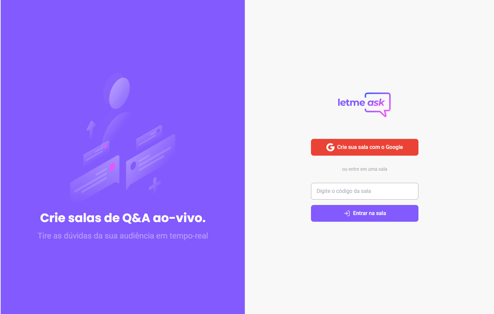
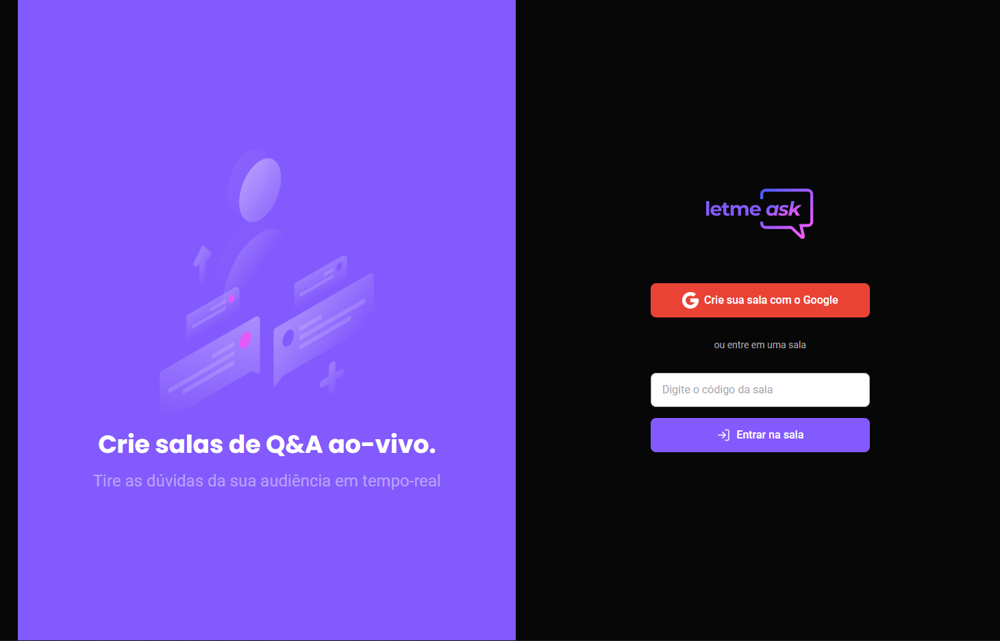
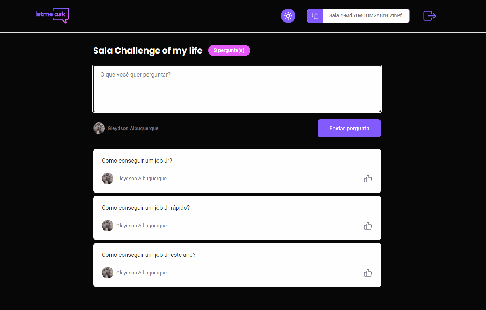

## 💻 Projeto

O LetmeAsk é uma plataforma para resolução de perguntas para um determinado nicho de pessoas, o administrador compartilha um hash da sala e os interessados podem acessar para tirar suas dúvidas.

<h2>🖥️ Tela principal: </h2>

  
  

<h2>🖥️ Sala para os usuários: </h2>

  

## ✨ Tecnologias

Esse projeto foi desenvolvido com as seguintes tecnologias:

- [ReactJS](https://reactjs.org)
- [TypeScript](https://www.typescriptlang.org/)
- [SASS](https://sass-lang.com/)
- [Firebase](https://firebase.google.com/)

## 🚀 Aplicação disponível online

Você pode testar e usar o LetmeAsk através [desse link](https://letmeask-9c5ff.web.app/).

## 🚀 Milha extra (recursos implementados além dos requisitos)

- Botão para deslogar da aplicação
- Dark Theme com persistência no localStorage

## 🚀 Como executar

- Clone o repositório
- Instale o [Node.js](https://nodejs.org/en/download/)
- Instale o [Yarn](https://classic.yarnpkg.com/en/docs/install/#windows-stable)
- Crie um projeto no [Firebase](https://firebase.google.com/)
- Adicione as credenciais do seu firebase em firebase.ts localizado na pasta services
- Ative o firebase authentication com a autenticação do google
- Inicie o servidor com `yarn start` no terminal

Agora você pode acessar [`localhost:3000`](http://localhost:3000) no seu navegador.

---

Feito por Gleydson Albuquerque no 6° NLW organizado pela Rocketseat, missão: ReactJS.
